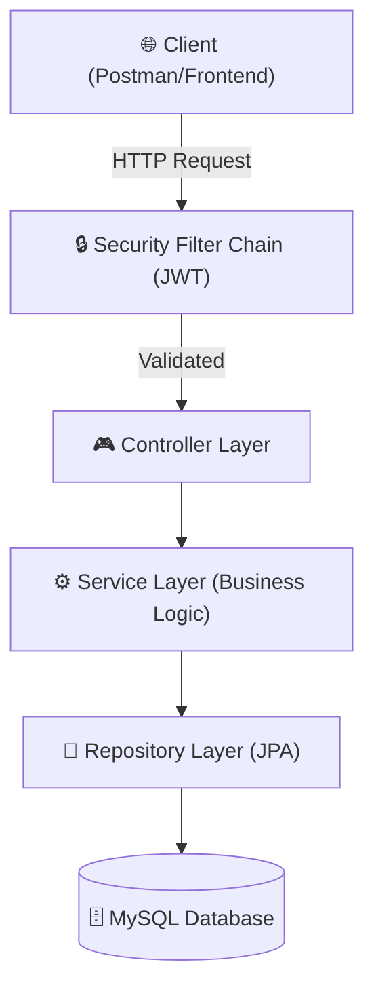

<div align="center">


[](https://oracle.com/java)
[](https://spring.io/projects/spring-boot)
[](https://mysql.com)
[](https://jwt.io)
[](https://springboot-student-api-production-32eb.up.railway.app)
[](https://github.com/B3rlinSugi/springboot-student-api)

</div>

---

## 📌 Overview

**Spring Boot Student API** adalah backend enterprise-grade yang dibangun menggunakan **Spring Boot 3** dan **Spring Security 6**. Proyek ini menerapkan arsitektur berlapis (N-Tier) yang ketat, menggunakan JWT untuk autentikasi stateless dan Spring Data JPA untuk persistensi relasional yang dioptimalkan.

> 💡 **Fokus Teknis:** Menunjukkan implementasi Spring Security modern, penanganan exception global, dan integrasi database relational dengan standar industri.

### 🏆 Hasil Pengujian & Standar

| Metrik | Status |
|---|---|
| Autentikasi Stateless (JWT) | ✅ **Terverifikasi** |
| Layered Architecture (N-Tier) | ✅ **Strictly Enforced** |
| Response Consistency | ✅ **Unified API Result** |
| Security Filter Chain | ✅ **Customized SC6** |

---

## ✨ Fitur Utama

- **🔐 Robust Security:** Autentikasi stateless via JWT yang terintegrasi penuh dengan filter chain Spring Security 6.
- **🏛️ N-Tier Architecture:** Pemisahan tanggung jawab yang jelas antara `Controller`, `Service`, dan `Repository` layer.
- **🔄 Mapper Pattern:** Implementasi Entity-to-DTO mapping untuk eksposur data yang aman dan terkontrol.
- **📡 RESTful Semantics:** Mendukung operasi CRUD lengkap dengan status code HTTP yang tepat.
- **🛡️ Global Exception Handling:** Penanganan error terpusat menggunakan `@RestControllerAdvice`.

---

## 🏗️ Arsitektur Sistem



---

## 📡 API Endpoints

### 🔑 Authentication
| Method | Endpoint | Deskripsi |
|---|---|---|
| `POST` | `/api/auth/register` | Membuat akun baru (Admin/User) |
| `POST` | `/api/auth/login` | Autentikasi dan menerima token JWT |

### 🎓 Student Management
*Memerlukan `Authorization: Bearer <token>`*
| Method | Endpoint | Deskripsi |
|---|---|---|
| `GET` | `/api/students` | Mengambil semua data mahasiswa |
| `GET` | `/api/students/{id}` | Mengambil detail mahasiswa tertentu |
| `POST` | `/api/students` | Membuat entri mahasiswa baru |
| `PUT` | `/api/students/{id}` | Memperbarui data mahasiswa |
| `DELETE` | `/api/students/{id}` | Menghapus data mahasiswa |

---

## ⚙️ DevOps & Deployment

Proyek ini dikelola dengan standar DevOps modern untuk memastikan reliabilitas dan kemudahan deployment:

- **Platform**: [Railway](https://railway.app)
- **CI/CD**: Deployment otomatis setiap kali ada perubahan pada branch `main`.
- **Environment Management**: Menggunakan `application.properties` yang dinamis untuk injeksi kredensial database di lingkungan produksi.
- **Build Tool**: Maven Wrapper (`./mvnw`) digunakan untuk memastikan integritas environment build di semua sistem.
- **Containerization Readiness**: Struktur proyek siap untuk di-containerize menggunakan Docker.

---

## 🚀 Cara Menjalankan Secara Lokal

### Prasyarat
- JDK 17+
- Maven 3.x
- MySQL 8.0

### Instalasi
1. **Clone Repository:**
   ```bash
   git clone https://github.com/B3rlinSugi/springboot-student-api.git
   cd springboot-student-api
   ```
2. **Konfigurasi Database:**
   Update `src/main/resources/application.properties` dengan kredensial MySQL lokal Anda.
3. **Run Application:**
   ```bash
   ./mvnw spring-boot:run
   ```

---

## 👤 Author

<div align="center">

**Berlin Sugiyanto Hutajulu**

[](https://github.com/B3rlinSugi)
[](https://linkedin.com/in/berlinsugi)
[](https://berlinsugi.vercel.app)

---

Built with ☕ and Spring Boot · Java Backend Excellence

</div>
