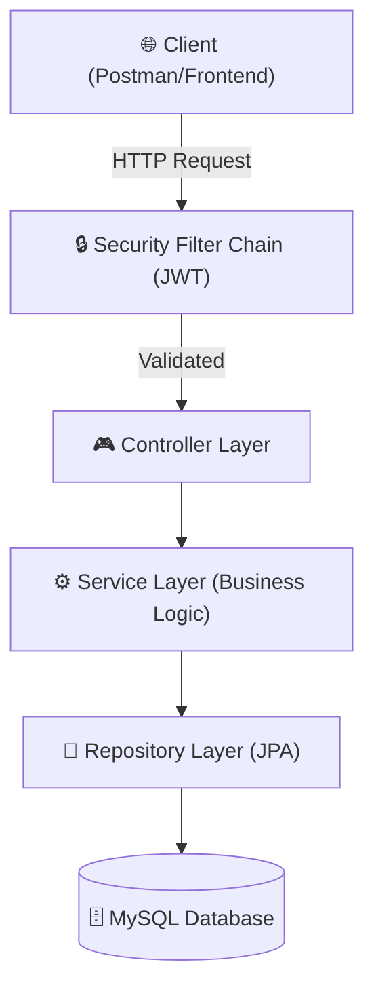
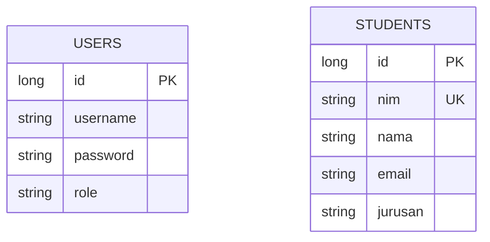

# ☕ Spring Boot Student API — Enterprise Java Backend

A high-performance Java backend built on **Spring Boot 3** and **Spring Security 6**. This project implements a strictly decoupled layered architecture, utilizing JWT for stateless authentication and Spring Data JPA for optimized relational persistence.

[](https://springboot-student-api-production-32eb.up.railway.app)
[](https://oracle.com/java)
[](https://spring.io)
[](https://mysql.com)

---

## 🏗 System Architecture

The system follows the **N-Tier Layered Architecture** pattern, ensuring absolute separation of concerns and high testability.



---

## ✨ Features

- **🔐 Robust Security:** Stateless authentication via JWT (JSON Web Tokens) integrated with Spring Security 6 filter chain.
- **🏛 Layered Design:** strictly enforced separation between `Controller` (Transport), `Service` (Business), and `Repository` (Persistence) layers.
- **🔄 Automated Mapping:** Efficient Entity-to-DTO mapping patterns for secure data exposure.
- **📡 RESTful CRUD:** Comprehensive student data management with standard HTTP semantics.
- **🛡 Input Validation:** Stringent server-side validation using Jakarta Validation API.

---

## 🔌 API Endpoints

### 🔑 Authentication
| Method | Endpoint | Description |
|---|---|---|
| `POST` | `/api/auth/register` | Create new account (Admin/User) |
| `POST` | `/api/auth/login` | Authenticate and receive JWT token |

### 🎓 Student Management
*Requires `Authorization: Bearer <token>`*
| Method | Endpoint | Description |
|---|---|---|
| `GET` | `/api/students` | Retrieve all student records |
| `GET` | `/api/students/{id}` | Retrieve specific student detail |
| `POST` | `/api/students` | Create a new student entry |
| `PUT` | `/api/students/{id}` | Update existing student record |
| `DELETE` | `/api/students/{id}` | Remove student record |

---

## 🗄 Database Schema

The persistence layer uses **Spring Data JPA** (Hibernate) to manage the following relational structure:



---

## 🚀 Execution Guide

### Prerequisites
- JDK 17+
- Maven 3.x
- MySQL 8.0

### Local Setup
1. **Clone & Enter:**
   ```bash
   git clone https://github.com/B3rlinSugi/springboot-student-api.git
   cd springboot-student-api
   ```

2. **Database Config:**
   Update `src/main/resources/application.properties` with your MySQL credentials:
   ```properties
   spring.datasource.url=jdbc:mysql://localhost:3306/db_student_management
   spring.datasource.username=root
   spring.datasource.password=your_password
   ```

3. **Run Application:**
   ```bash
   ./mvnw spring-boot:run
   ```

---

## 👨‍💻 Developed By

**Berlin Sugiyanto Hutajulu**

[](https://github.com/B3rlinSugi)
[](https://linkedin.com/in/berlinsugi)
[](https://berlinsugi.vercel.app)

---

## ⚙️ DevOps & Deployment

- **Platform**: [Railway](https://railway.app)
- **CI/CD**: Fully automated deployment triggered by `git push` to `main`.
- **Environment Management**: Dynamic environment variable injection for database credentials.
- **Artifacts**: Uses the Maven wrapper (`./mvnw`) to ensure consistent build environments across different systems.

---
<p align="center">Built with ☕ and Spring Boot · High Performance Java Backend</p>

